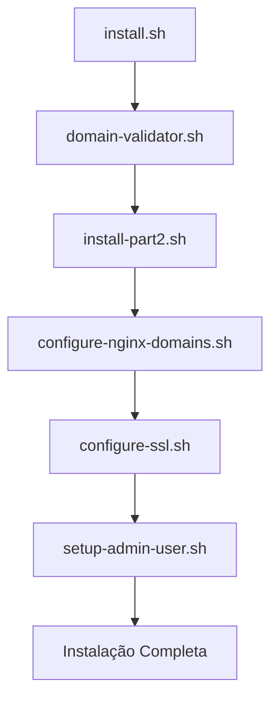

# Scripts de Instalação Automática

Este diretório contém os scripts especializados para instalação e configuração automática do Nowhats em servidores Ubuntu 22.04.

## Visão Geral dos Scripts

### Scripts Principais

| Script | Função | Dependências |
|--------|--------|-------------|
| `domain-validator.sh` | Assistente interativo de configuração de domínios | `dig`, `curl`, `netstat` |
| `configure-nginx-domains.sh` | Configuração automática do Nginx | `nginx`, arquivos de template |
| `configure-ssl.sh` | Configuração automática de SSL/TLS | `certbot`, `nginx` |
| `setup-admin-user.sh` | Criação do usuário administrador | `curl`, `docker-compose` |
| `test-domain-config.sh` | Validação dos scripts de configuração | `bash` |

## Detalhamento dos Scripts

### 1. domain-validator.sh

**Propósito**: Assistente interativo para configuração e validação de domínios.

**Funcionalidades**:
- Validação de formato de domínio
- Verificação de resolução DNS
- Teste de conectividade HTTP/HTTPS
- Suporte a domínio único ou subdomínios
- Geração de configuração automática

**Uso**:
```bash
./scripts/domain-validator.sh
```

**Saídas**:
- `/tmp/domain_config` - Configuração temporária
- `/opt/nowhats/.domain_config` - Configuração final

**Variáveis Geradas**:
```bash
DOMAIN_OPTION="single|subdomain"
MAIN_DOMAIN="exemplo.com"
FRONTEND_DOMAIN="app.exemplo.com"
BACKEND_DOMAIN="api.exemplo.com"
API_PATH="/api"
```

### 2. configure-nginx-domains.sh

**Propósito**: Configuração automática do Nginx baseada no tipo de domínio.

**Funcionalidades**:
- Geração de arquivos de configuração Nginx
- Substituição de placeholders nos templates
- Ativação de sites e desativação do padrão
- Teste de configuração
- Reload do Nginx

**Uso**:
```bash
./scripts/configure-nginx-domains.sh
```

**Pré-requisitos**:
- Arquivo `/opt/nowhats/.domain_config` existente
- Template `/opt/nowhats/nginx/nowhats.conf`
- Nginx instalado

**Configurações Aplicadas**:
- Proxy reverso para frontend e backend
- Headers de segurança
- Compressão gzip
- Rate limiting
- Redirecionamento HTTP para HTTPS

### 3. configure-ssl.sh

**Propósito**: Configuração automática de certificados SSL usando Let's Encrypt.

**Funcionalidades**:
- Verificação de pré-requisitos (Nginx, Certbot)
- Validação de acessibilidade de domínios
- Obtenção de certificados SSL
- Configuração de renovação automática
- Aplicação de configurações de segurança avançadas

**Uso**:
```bash
./scripts/configure-ssl.sh
```

**Pré-requisitos**:
- Domínios acessíveis via HTTP
- Nginx configurado e funcionando
- Certbot instalado
- Email válido para Let's Encrypt

**Configurações de Segurança**:
```nginx
# Headers de segurança
add_header Strict-Transport-Security "max-age=31536000; includeSubDomains" always;
add_header X-Content-Type-Options nosniff;
add_header X-Frame-Options DENY;
add_header X-XSS-Protection "1; mode=block";

# Configurações SSL
ssl_protocols TLSv1.2 TLSv1.3;
ssl_ciphers ECDHE-RSA-AES256-GCM-SHA512:DHE-RSA-AES256-GCM-SHA512;
ssl_prefer_server_ciphers off;
```

### 4. setup-admin-user.sh

**Propósito**: Criação automática do usuário administrador padrão.

**Funcionalidades**:
- Validação de email e senha
- Geração de senha segura
- Aguarda disponibilidade da API
- Criação via API REST
- Fallback para criação direta no banco
- Salvamento seguro de credenciais

**Uso**:
```bash
./scripts/setup-admin-user.sh
```

**Variáveis de Ambiente**:
```bash
ADMIN_EMAIL="admin@exemplo.com"
ADMIN_PASSWORD="senha_gerada_automaticamente"
API_URL="https://api.exemplo.com"
```

**Saída**:
- `/opt/nowhats/.admin_credentials` - Credenciais do administrador

### 5. test-domain-config.sh

**Propósito**: Validação e teste dos scripts de configuração.

**Funcionalidades**:
- Teste de sintaxe dos scripts
- Verificação de executabilidade
- Validação de templates
- Teste de dependências
- Verificação de permissões

**Uso**:
```bash
./scripts/test-domain-config.sh
```

**Testes Realizados**:
1. Sintaxe bash de todos os scripts
2. Presença de placeholders nos templates
3. Disponibilidade de comandos (`dig`, `curl`, `netstat`)
4. Permissões de escrita em diretórios
5. Executabilidade como root

## Fluxo de Execução

### Sequência Normal de Instalação



### Dependências entre Scripts

1. **domain-validator.sh** → Gera configuração de domínios
2. **configure-nginx-domains.sh** → Usa configuração de domínios
3. **configure-ssl.sh** → Requer Nginx configurado
4. **setup-admin-user.sh** → Requer API funcionando

## Configurações e Arquivos

### Arquivos de Configuração Gerados

| Arquivo | Conteúdo | Usado por |
|---------|----------|----------|
| `/opt/nowhats/.domain_config` | Configuração de domínios | Todos os scripts |
| `/opt/nowhats/.install_config` | Variáveis de instalação | install-part2.sh |
| `/opt/nowhats/.admin_credentials` | Credenciais do admin | Manual |
| `/etc/nginx/sites-available/nowhats` | Configuração Nginx | Sistema |
| `/opt/nowhats/.env` | Variáveis de ambiente | Aplicação |

### Templates Utilizados

- **`/opt/nowhats/nginx/nowhats.conf`** - Template base do Nginx
- Placeholders substituídos:
  - `{{FRONTEND_DOMAIN}}` - Domínio do frontend
  - `{{BACKEND_DOMAIN}}` - Domínio do backend
  - `{{API_PATH}}` - Caminho da API
  - `{{SSL_CERTIFICATE}}` - Caminho do certificado
  - `{{SSL_CERTIFICATE_KEY}}` - Caminho da chave privada

## Logs e Debugging

### Logs dos Scripts

Todos os scripts geram logs detalhados:

```bash
# Logs em tempo real
tail -f /var/log/nowhats-install.log

# Logs específicos por script
grep "domain-validator" /var/log/nowhats-install.log
grep "configure-ssl" /var/log/nowhats-install.log
```

### Debugging

Para executar scripts em modo debug:

```bash
# Ativar debug bash
bash -x ./scripts/domain-validator.sh

# Ou definir variável
export DEBUG=1
./scripts/configure-ssl.sh
```

### Verificação de Status

```bash
# Verificar configuração de domínios
cat /opt/nowhats/.domain_config

# Verificar configuração Nginx
nginx -t

# Verificar certificados SSL
certbot certificates

# Verificar credenciais admin
cat /opt/nowhats/.admin_credentials
```

## Solução de Problemas

### Problemas Comuns

#### 1. Erro de Resolução DNS
```bash
# Verificar DNS
dig +short exemplo.com

# Testar conectividade
curl -I http://exemplo.com
```

#### 2. Falha na Obtenção de SSL
```bash
# Verificar logs do Certbot
tail -f /var/log/letsencrypt/letsencrypt.log

# Testar manualmente
certbot certonly --nginx -d exemplo.com --dry-run
```

#### 3. API Não Disponível
```bash
# Verificar containers
docker-compose ps

# Verificar logs da API
docker-compose logs nowhats-backend
```

#### 4. Permissões Insuficientes
```bash
# Verificar usuário atual
whoami

# Executar como root
sudo ./scripts/script-name.sh
```

### Recuperação de Falhas

#### Reexecutar Configuração de Domínios
```bash
rm -f /opt/nowhats/.domain_config
./scripts/domain-validator.sh
```

#### Reconfigurar Nginx
```bash
rm -f /etc/nginx/sites-enabled/nowhats
./scripts/configure-nginx-domains.sh
```

#### Renovar Certificados SSL
```bash
certbot delete --cert-name exemplo.com
./scripts/configure-ssl.sh
```

#### Recriar Usuário Admin
```bash
rm -f /opt/nowhats/.admin_credentials
./scripts/setup-admin-user.sh
```

## Personalização

### Modificar Configurações Padrão

Para personalizar as configurações, edite as variáveis no início de cada script:

```bash
# Em domain-validator.sh
DEFAULT_API_PATH="/api/v1"  # Mudar caminho da API
DEFAULT_SSL_EMAIL="admin@empresa.com"  # Email padrão

# Em configure-ssl.sh
SSL_KEY_SIZE=4096  # Tamanho da chave SSL
RENEW_HOOK="systemctl reload nginx"  # Hook de renovação

# Em setup-admin-user.sh
PASSWORD_LENGTH=16  # Tamanho da senha gerada
MAX_RETRIES=10  # Tentativas de conexão com API
```

### Adicionar Novos Domínios

Para adicionar suporte a novos tipos de configuração de domínio:

1. Modifique `domain-validator.sh` para incluir nova opção
2. Atualize `configure-nginx-domains.sh` para gerar configuração apropriada
3. Ajuste `configure-ssl.sh` para obter certificados para novos domínios

## Contribuição

Para contribuir com melhorias nos scripts:

1. Teste todas as modificações com `test-domain-config.sh`
2. Mantenha compatibilidade com Ubuntu 22.04
3. Documente novas funcionalidades
4. Adicione tratamento de erros apropriado
5. Siga as convenções de nomenclatura existentes

---

**Nota**: Todos os scripts foram projetados para serem idempotentes, ou seja, podem ser executados múltiplas vezes sem causar problemas.